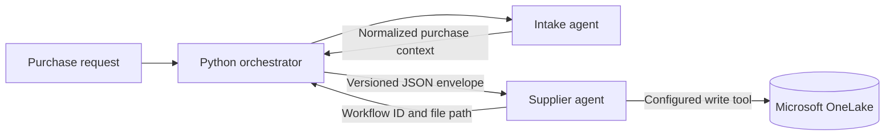

# Foundry Intake-to-Supplier Orchestrator

This sample calls two existing Microsoft Foundry prompt agents in sequence:



The agents do not share a Foundry conversation. The orchestrator reads the intake
response, wraps it with workflow metadata, and supplies that envelope as a new input
to the supplier agent. This makes the handoff explicit and auditable.

## Prerequisites

- Python 3.9 or later.
- Azure CLI, signed in to the correct tenant and subscription.
- A Microsoft Foundry project using the new project endpoint format:
  `https://<resource>.services.ai.azure.com/api/projects/<project>`.
- Two existing prompt agents in that project, named `intake` and `supplier` by
  default.
- The caller has at least the Foundry project permissions required to read and
  invoke both agents, such as the **Foundry User** role at project scope.
- The supplier agent has a tool that can write to the target OneLake location.

This sample uses `azure-ai-projects` 2.x. It is not compatible with Foundry
(classic) agents that use the older threads/runs API.

## 1. Configure the agents

### Intake agent

Give the intake agent instructions that normalize purchase requests consistently.
For example:

```text
Extract the item, description, quantity, unit, budget, currency, requester,
delivery location, required date, cost center, and supplier constraints. Return
valid JSON only. Use null for unknown optional fields and list missing required
fields in missing_fields. Never invent values.
```

### Supplier agent

Give the supplier agent a stable JSON contract and require it to call its OneLake
write tool. For example:

```text
Read the purchase context supplied by the orchestrator. Validate required fields,
generate the final supplier purchase JSON, and call write_purchase_to_onelake.
Return a receipt with workflow_id, status, and path. Do not claim success unless
the tool confirms the write.
```

An agent cannot write to OneLake from instructions alone. Add a Foundry tool such
as an OpenAPI action backed by an Azure Function or API that writes with the
OneLake DFS endpoint. A minimal tool contract is:

```json
{
  "workflow_id": "string",
  "json_content": "string",
  "relative_path": "Files/purchases/<workflow_id>.json"
}
```

The tool should return `status`, `path`, and an immutable write identifier such as
an ETag. Grant the tool's managed identity access to the target Fabric workspace
and OneLake item, then test the tool from the supplier agent playground first.

## 2. Set up Python

From this folder in PowerShell:

```powershell
py -m venv .venv
.\.venv\Scripts\Activate.ps1
python -m pip install --upgrade pip
python -m pip install -r requirements.txt
az login
```

For workload hosting, `DefaultAzureCredential` can use a managed identity instead
of an interactive Azure CLI login.

## 3. Set configuration

Find the project endpoint on the Foundry project overview page. Set these values
in the same PowerShell session:

```powershell
$env:FOUNDRY_PROJECT_ENDPOINT = "https://YOUR-RESOURCE.services.ai.azure.com/api/projects/YOUR-PROJECT"
$env:INTAKE_AGENT_NAME = "intake"
$env:SUPPLIER_AGENT_NAME = "supplier"
```

The agent names are optional when the defaults match. The endpoint is required.
The [.env.example](.env.example) file is a reference only; this sample deliberately
does not load secrets or settings from a committed file.

## 4. Run the workflow

Run the built-in example:

```powershell
python a2a.py
```

Or pass a purchase request:

```powershell
python a2a.py "Purchase 40 monitors for London, required by 2026-11-01, budget GBP 12000"
```

The console prints the supplier agent's receipt. Confirm that its returned path
exists in OneLake before treating the workflow as complete.

## 5. Run the local test

The test uses fake clients and does not call Azure or consume model tokens:

```powershell
python -m unittest -v
```

It verifies that intake runs first and that its exact output appears in the JSON
envelope sent to supplier.

## Context contract

The orchestrator sends the supplier agent this structure:

```json
{
  "schema_version": "1.0",
  "workflow_id": "generated UUID",
  "created_at_utc": "ISO-8601 timestamp",
  "source_agent": "intake",
  "original_purchase_request": "original user input",
  "intake_result": "exact intake agent output"
}
```

For production, validate the intake result against a JSON Schema before invoking
the supplier, persist workflow status outside the model conversation, use the
workflow ID as an idempotency key, retry only transient failures, and avoid logging
sensitive purchase data.

## Troubleshooting

- `Set FOUNDRY_PROJECT_ENDPOINT`: set the endpoint in the current shell.
- `401` or `403`: run `az login` for local use and verify Foundry project RBAC.
- Agent not found: confirm the agent name and that it is in the endpoint's project.
- OneLake file is missing: inspect the supplier tool result and Fabric permissions;
  a text response from the model is not proof that a write occurred.
- Empty agent output: inspect the agent run in Foundry and verify its active version.

## References

- [Microsoft Foundry SDK quickstart](https://learn.microsoft.com/azure/foundry/quickstarts/get-started-code)
- [Azure AI Projects Python client](https://learn.microsoft.com/python/api/overview/azure/ai-projects-readme)
- [Microsoft OneLake access APIs](https://learn.microsoft.com/fabric/onelake/onelake-access-api)